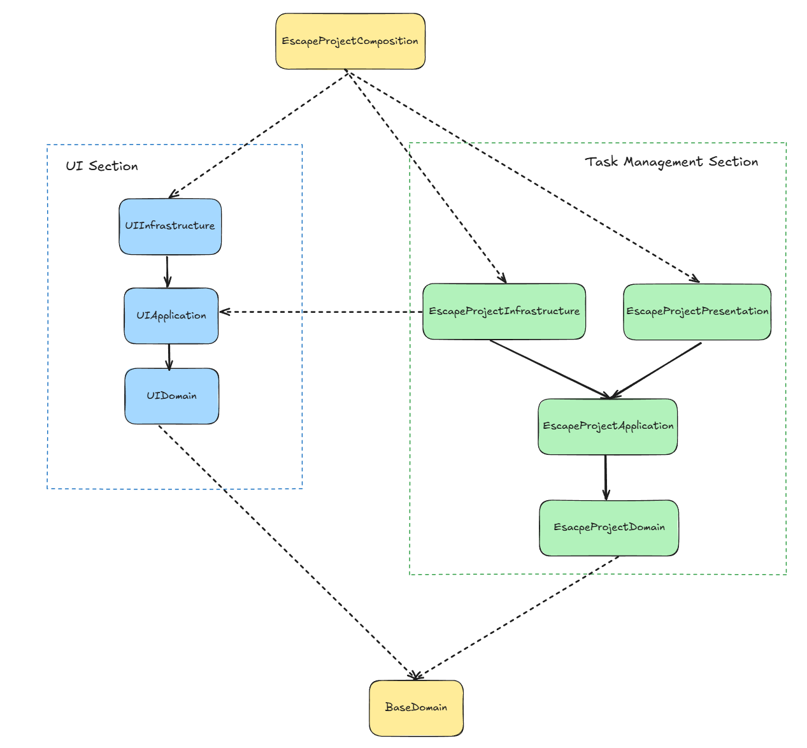
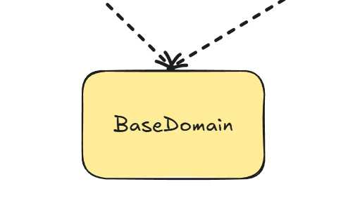
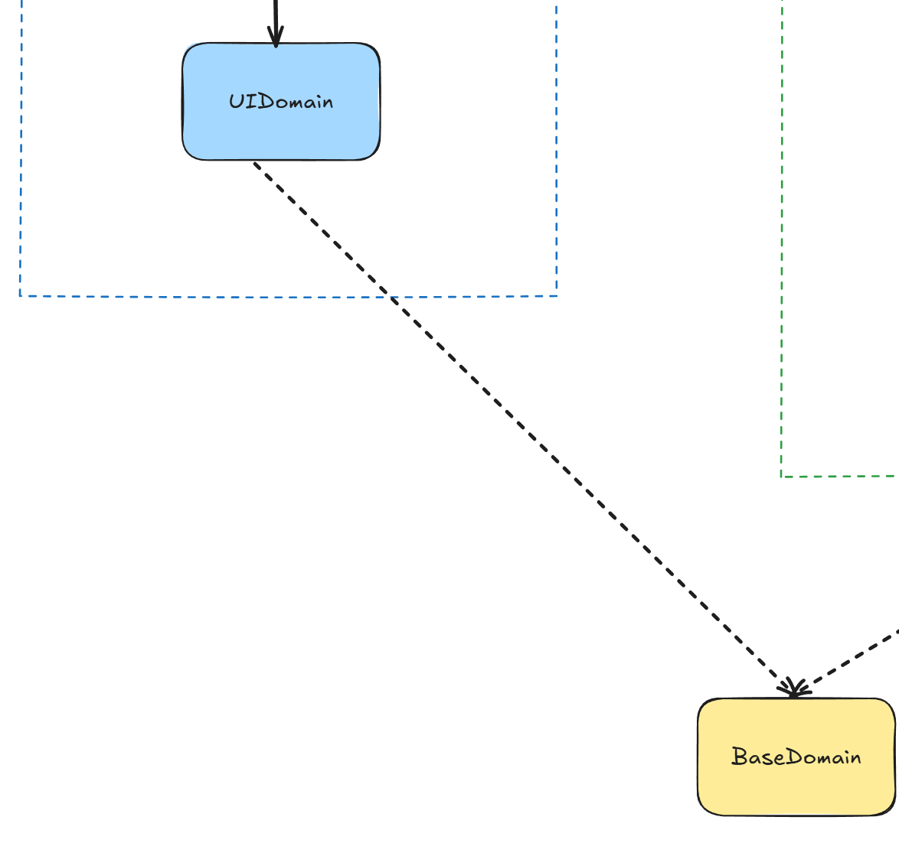
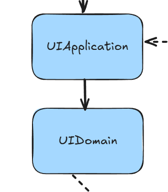

# Architecture of Escape Project

[← Back to Documentation Index](../README.md)

EscapeProject is built using Clean Architecture and Domain-Driven Design principles, making the codebase highly modular, maintainable, and extensible.  
This approach was chosen to enable two main goals:  
- **Flexibility in output formats** – new file formats for task plans can be added with minimal effort.  
- **Flexibility in interfaces** – new ways of interacting with the app (CLI tool, desktop app, web server, etc.) can be introduced without disrupting existing functionality.

---

## Table of Contents

- [High level description of modules](#high-level-description-of-modules)

---

## High level description of modules



Escape Project is broadly divided into two sections:

- **UI Section**  
  The UI Section defines and implements an abstract representation of the user interface that does not depend on any particular UI system. Whether the interface is Excel, PDF, or a web page, they are all built using the same set of classes from this section.  
  For example, when defining the UI for a task plan in PDF, you might use `TextSettings` from the `UIDomain`. The same `TextSettings` class would also be used when describing the UI for Excel files. This consistency allows the Task Management Section to describe UIs using a unified set of classes, regardless of the output format. As a result, the codebase remains both readable and maintainable.  
  In addition, the UI Section provides services for interacting with specific UI systems through external libraries. For instance, it includes `ITextPDFService`, which handles rendering the PDF interface.  

 - **Task Management Section**  
  The Task Management Section is responsible for the core functionality of Escape Project - managing tasks, enforcing business rules, validating input, and generating task plans.  
  The domain logic is defined using Domain-Driven Design (DDD), with rules implemented in the Domain layer and orchestrated in the Application layer by building on top of `BaseDomain`.  
  Task plans are rendered in the Infrastructure layer through renderers that delegate to the `PDFService` and other UI abstractions provided by the UI Section.  
  Finally, the Presentation layer exposes a CLI interface, allowing users to interact with the application directly.
---

## UI Section

### BaseDomain


The **BaseDomain** module provides the foundational building blocks for implementing Domain-Driven Design (DDD) across the project. It defines abstract classes and base concepts that represent core DDD patterns, such as **Entities, Aggregate Roots, Value Objects, and Repositories**, ensuring that all domain logic throughout the application is consistent, expressive, and reusable.  

Unlike other modules, BaseDomain has **no external library dependencies**, making it highly portable and lightweight. All other modules in the project reference it either:  
- **Explicitly**: the Task Management Domain module directly inherits and implements its abstractions, following DDD principles.  
- **Implicitly**: other modules (e.g., Application, Infrastructure) reference it indirectly through their interaction with the domain.  
- The UI Domain (`UIDomain`) currently references it but does not yet make active use of these classes, leaving room for future evolution.  

---

### Key Concepts in BaseDomain

- **Entity**  
  Represents a domain object that is uniquely identified by an `Id`. Entities carry identity and lifecycle but can change their attributes over time. Equality is based on the identity rather than object reference.  

- **AggregateRoot**  
  A specialization of `Entity` that acts as the root of an aggregate. It is responsible for maintaining consistency within the aggregate’s boundaries and serves as the only entry point for modifying related entities.  

- **ValueObject**  
  Represents immutable objects that are compared by their values rather than identity. For example, a `NormalizedString` trims and normalizes whitespace, ensuring consistency and validation at construction time. Value objects enforce invariants and provide safety by eliminating invalid states.  

- **Repository Interface**  
  Provides an abstraction for accessing and persisting aggregates. It defines the contract for storage operations without committing to a specific persistence mechanism. Concrete implementations are defined later in the Infrastructure layer.  

- **Utility Classes (e.g., NormalizedString)**  
  Demonstrates how `ValueObject` can be extended to enforce domain rules. `NormalizedString` guarantees that string values are non-empty, trimmed, and whitespace-normalized, providing safe and consistent text handling across the domain.  

---

### Why BaseDomain Matters

By centralizing DDD building blocks in a dedicated module, BaseDomain ensures:  
- **Consistency** – every Entity, Value Object, or Aggregate follows the same rules across the entire system.  
- **Maintainability** – domain rules are separated from technical concerns, making the code easier to reason about and evolve.  
- **Extensibility** – new domain models can be created quickly by reusing these base abstractions.  
- **Purity** – because BaseDomain has no external dependencies, it is isolated from infrastructure concerns and remains focused purely on expressing domain concepts.  

---

📌 In practice, this means that when the **Task Management Domain** defines concepts like `Task` or `TaskGroup`, they extend `Entity` or `AggregateRoot`, while fields like `Name` can build on `ValueObject` abstractions. This enforces DDD principles consistently across the project without repeating boilerplate.

### UIDomain


The **UIDomain** module defines reusable, **UI-indifferent element settings** and their corresponding builders.  
These abstractions are not tied to any specific UI system (e.g., PDF, Excel, Web) and can be applied consistently across different rendering technologies.  

By centralizing UI definitions in a single module, every UI system in Escape Project makes use of the **same set of classes**, ensuring consistency, maintainability, and readability. For example, a checkbox in a PDF will be described using the same `CheckboxSettings` class as a checkbox in Excel or a future web interface.

---

### Example: CheckboxSettings

Checkboxes in Escape Project are defined using two classes:  

- **`CheckboxSettingsBuilder`** – a builder class that allows developers to configure properties like size, default state, and text settings before constructing a checkbox definition.  
- **`CheckboxSettings`** – a settings object that represents the final configuration of a checkbox, including validation rules.  

```csharp
var checkboxSettings = new CheckboxSettingsBuilder()
    .WithSize(20)
    .WithDefaultChecked(true)
    .WithText(new TextSettingsBuilder().WithFontSize(12).WithBold())
    .Build();
```

In this example:

- `WithSize(20)` sets the checkbox size (default is 15).  
- `WithDefaultChecked(true)` sets the checkbox to be checked by default.  
- `WithText(...)` attaches text styling (e.g., font size, bold) using `TextSettingsBuilder` from the **Text** namespace.  

The resulting `CheckboxSettings` object can then be passed to **any UI system**:  

- In the **PDF renderer**, it might be drawn using `ITextPDFService`.  
- In the **Excel renderer**, it might be drawn using `ClosedXMLExcelService`.
- A future **Web renderer** could reuse the same definition without modifying business code.  

---

### Why This Matters

By separating **UI definitions** (in `UIDomain`) from **UI implementations** (in `UIInfrastructure`), Escape Project achieves:  

- **Consistency** – all UI systems use the same definitions for elements like text, checkboxes, and other controls.  
- **Maintainability** – changes to element definitions (e.g., default checkbox size) are made in one place.  
- **Extensibility** – new UI systems (e.g., Web or Desktop GUI) can be added with minimal effort, reusing the same definitions.  

### UIApplication


The **UIApplication** module defines the interfaces and metadata classes for each UI system supported by Escape Project.  
It references **UIDomain** to reuse generic UI elements (such as text or checkbox settings), but it does not depend on any external libraries.  
This makes it possible to describe **what a UI should look like and how it should behave** without committing to a specific library.  

UIApplication also contains **metadata classes** that simplify and unify the configuration of UI services.  
Each concrete UI service (implemented later in `UIInfrastructure`) builds upon these abstractions, ensuring consistency across different library implementations.  

---

### Example: ExcelService

For the Excel UI, UIApplication defines the following key components:  

- **`ExcelMetadata` / `ExcelMetadataBuilder`**  
  A metadata class and its builder used to configure Excel output.  
  It validates the destination path and ensures the worksheet columns are defined and unique before creating an Excel document.  

- **`ExcelService`**  
  An abstract class that represents a generic Excel UI service.  
  It manages the state of the Excel document, such as the active worksheet, current position, and available worksheets.  
  It also defines abstract rendering methods for UI elements like text and select boxes, which concrete implementations will provide.  

- **`ExcelServiceFactory`**  
  A factory abstraction for creating `ExcelService` instances from metadata builders.  

---

#### Example Usage

```csharp
var metadataBuilder = new ExcelMetadataBuilder()
    .WithDestination("OutputPlans/MyPlan.xlsx")
    .WithColumns(new List<TextSettingsBuilder>
    {
        new TextSettingsBuilder().WithText("Task"),
        new TextSettingsBuilder().WithText("Status"),
        new TextSettingsBuilder().WithText("Duration"),
        new TextSettingsBuilder().WithText("Time Range")
    });

// Later, the concrete ExcelService (from UIInfrastructure) will be created using this metadata.
ExcelService excelService = myExcelServiceFactory.Create(metadataBuilder);
```

### Why This Matters

By defining **UI services** and their metadata in UIApplication:  

- **Consistency** – every UI implementation (PDF, Excel, Web, etc.) follows the same structure for rendering elements and managing state.  
- **Flexibility** – new libraries can be introduced by implementing the abstract services (e.g., `ExcelService`, `PdfService`), without modifying domain or application code.  
- **Maintainability** – changes to metadata or rendering contracts are made in one place, applying uniformly across all UI systems.  
- **Separation of Concerns** – business logic and UI definitions remain independent from library-specific details.  

This pattern ensures that Escape Project can support multiple UIs (CLI-driven Excel, interactive PDFs, or future Web/Desktop frontends) while reusing the same definitions from **UIDomain** and keeping the architecture clean.  

### UIInfrastructure


The **UIInfrastructure** module provides the **concrete implementations** of the abstract UI services defined in `UIApplication`.  
It references **UIApplication** and has access to external dependencies, allowing it to bind high-level UI contracts to actual libraries (e.g., ClosedXML for Excel, iText for PDF).  

This separation ensures that the Escape Project can switch libraries or add new implementations without changing the core application or domain code.  

---

### Example: ClosedXMLExcelService

A concrete implementation of `ExcelService` using the [ClosedXML](https://github.com/ClosedXML/ClosedXML) library is provided in `UIInfrastructure.Excel`.  

- **Responsibilities**:  
  - Create and manage Excel workbooks and worksheets.  
  - Render UI elements such as text and dropdowns defined in `UIDomain`.  
  - Apply metadata provided by `UIApplication.Excel.ExcelMetadata` to ensure structure and validation rules are enforced.  
  - Handle persistence by saving the workbook to the destination path.  

---

#### Key Behaviors

- **OnMetadataSet** – Initializes a new workbook and creates a hidden worksheet for storing dropdown options.  
- **OnNewWorksheetCreated** – Creates a new worksheet, inserts column headers based on `ExcelMetadata.Columns`, and applies text styling.  
- **RenderText** – Writes text into the current cell, applying font size, weight, and style according to `TextSettingsBuilder`.  
- **RenderSelect** – Writes a dropdown (select element) into the Excel sheet, populates options in a hidden sheet, and enforces validation rules according to `SelectSettingsBuilder`.  
- **Close** – Finalizes the workbook by auto-adjusting column widths, protecting worksheets, and saving to disk.  

---

#### Example Usage

```csharp
var metadataBuilder = new ExcelMetadataBuilder()
    .WithDestination("TaskPlans/Plan.xlsx")
    .WithColumns(new List<TextSettingsBuilder>
    {
        new TextSettingsBuilder().WithText("Task"),
        new TextSettingsBuilder().WithText("Status"),
        new TextSettingsBuilder().WithText("Duration"),
        new TextSettingsBuilder().WithText("Time Range")
    });

// Concrete implementation in UIInfrastructure
ExcelService excelService = new ClosedXMLExcelService(metadataBuilder);

// Render text into the Excel document
excelService.RenderText(new TextSettingsBuilder().WithText("Write Documentation"));
excelService.Close();
```

### Why This Matters

By placing external dependencies in `UIInfrastructure`:  

- **Encapsulation** – the rest of the system depends only on abstract definitions in `UIApplication`, never directly on ClosedXML, iText, or other libraries.  
- **Flexibility** – new UI libraries can be introduced by adding new infrastructure implementations without modifying business or application logic.  
- **Maintainability** – external dependencies are isolated, keeping the core layers clean and free from technical concerns.  
- **Extensibility** – Escape Project can support additional UI systems (e.g., desktop GUI, web UI) by implementing the appropriate abstract service in `UIInfrastructure`.  