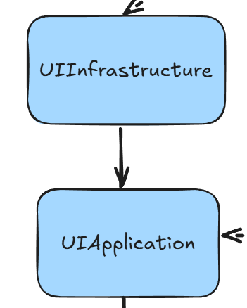

# Architecture of Escape Project

[← Back to Documentation Index](../README.md)

EscapeProject is built using Clean Architecture and Domain-Driven Design principles, making the codebase highly modular, maintainable, and extensible.  
This approach was chosen to enable two main goals:  
- **Flexibility in output formats** – new file formats for task plans can be added with minimal effort.  
- **Flexibility in interfaces** – new ways of interacting with the app (CLI tool, desktop app, web server, etc.) can be introduced without disrupting existing functionality.

---

## Table of Contents

- [High Level Description of Modules](#high-level-description-of-modules)
- [UI Section](#ui-section)
  - [BaseDomain](#basedomain)
  - [UIDomain](#uidomain)
  - [UIApplication](#uiapplication)
  - [UIInfrastructure](#uiinfrastructure)

---

## High level description of modules


Escape Project is broadly divided into two sections:

- **UI Section**  
  Defines and implements an abstract representation of the user interface that does not depend on any particular UI system (Excel, PDF, Web, etc.).  
  This ensures all interfaces are described using the same set of classes, keeping the codebase consistent and maintainable.  
  It also provides services for interacting with specific UI systems through external libraries (e.g., `ITextPDFService`).  

- **Task Management Section**  
  Responsible for the core functionality of Escape Project — managing tasks, enforcing business rules, validating input, and generating task plans.  
  Domain logic is defined using Domain-Driven Design (DDD) with rules implemented in the Domain layer and orchestrated in the Application layer, building on top of `BaseDomain`.  
  Rendering is performed in the Infrastructure layer, while the Presentation layer exposes a CLI interface for interacting with the app.  

---

## UI Section

### BaseDomain


The **BaseDomain** module provides the foundational building blocks for implementing Domain-Driven Design (DDD) across the project. It defines abstract classes and base concepts that represent core DDD patterns, such as **Entities, Aggregate Roots, Value Objects, and Repositories**, ensuring that all domain logic throughout the application is consistent, expressive, and reusable.  

Unlike other modules, BaseDomain has **no external library dependencies**, making it highly portable and lightweight. All other modules in the project reference it either:  
- **Explicitly**: the Task Management Domain module directly inherits and implements its abstractions, following DDD principles.  
- **Implicitly**: other modules (e.g., Application, Infrastructure) reference it indirectly through their interaction with the domain.  
- The UI Domain (`UIDomain`) currently references it but does not yet make active use of these classes, leaving room for future evolution.  

---

### Key Concepts in BaseDomain

- **Entity**  
  Represents a domain object that is uniquely identified by an `Id`. Entities carry identity and lifecycle but can change their attributes over time. Equality is based on the identity rather than object reference.  

- **AggregateRoot**  
  A specialization of `Entity` that acts as the root of an aggregate. It is responsible for maintaining consistency within the aggregate’s boundaries and serves as the only entry point for modifying related entities.  

- **ValueObject**  
  Represents immutable objects that are compared by their values rather than identity. For example, a `NormalizedString` trims and normalizes whitespace, ensuring consistency and validation at construction time. Value objects enforce invariants and provide safety by eliminating invalid states.  

- **Repository Interface**  
  Provides an abstraction for accessing and persisting aggregates. It defines the contract for storage operations without committing to a specific persistence mechanism. Concrete implementations are defined later in the Infrastructure layer.  

- **Utility Classes (e.g., NormalizedString)**  
  Demonstrates how `ValueObject` can be extended to enforce domain rules. `NormalizedString` guarantees that string values are non-empty, trimmed, and whitespace-normalized, providing safe and consistent text handling across the domain.  

---

### Why BaseDomain Matters

By centralizing DDD building blocks in a dedicated module, BaseDomain ensures:  
- **Consistency** – every Entity, Value Object, or Aggregate follows the same rules across the entire system.  
- **Maintainability** – domain rules are separated from technical concerns, making the code easier to reason about and evolve.  
- **Extensibility** – new domain models can be created quickly by reusing these base abstractions.  
- **Purity** – because BaseDomain has no external dependencies, it is isolated from infrastructure concerns and remains focused purely on expressing domain concepts.  

---

In practice, this means that when the **Task Management Domain** defines concepts like `Task` or `TaskGroup`, they extend `Entity` or `AggregateRoot`, while fields like `Name` can build on `ValueObject` abstractions. This enforces DDD principles consistently across the project without repeating boilerplate.

---

### UIDomain


The **UIDomain** module defines reusable, **UI-indifferent element settings** and their corresponding builders.  
These abstractions are not tied to any specific UI system (e.g., PDF, Excel, Web) and can be applied consistently across different rendering technologies.  

By centralizing UI definitions in a single module, every UI system in Escape Project makes use of the **same set of classes**, ensuring consistency, maintainability, and readability. For example, a checkbox in a PDF will be described using the same `CheckboxSettings` class as a checkbox in Excel or a future web interface.

---

### Example: CheckboxSettings

Checkboxes in Escape Project are defined using two classes:  

- **`CheckboxSettingsBuilder`** – a builder class that allows developers to configure properties like size, default state, and text settings before constructing a checkbox definition.  
- **`CheckboxSettings`** – a settings object that represents the final configuration of a checkbox, including validation rules.  

```csharp
var checkboxSettings = new CheckboxSettingsBuilder()
    .WithSize(20)
    .WithDefaultChecked(true)
    .WithText(new TextSettingsBuilder().WithFontSize(12).WithBold())
    .Build();
```

In this example:

- `WithSize(20)` sets the checkbox size (default is 15).  
- `WithDefaultChecked(true)` sets the checkbox to be checked by default.  
- `WithText(...)` attaches text styling (e.g., font size, bold) using `TextSettingsBuilder` from the **Text** namespace.  

The resulting `CheckboxSettings` object can then be passed to **any UI system**:  

- In the **PDF renderer**, it might be drawn using `ITextPDFService`.  
- In the **Excel renderer**, it might be drawn using `ClosedXMLExcelService`.
- A future **Web renderer** could reuse the same definition without modifying business code.  

---

### Why This Matters

By separating **UI definitions** (in `UIDomain`) from **UI implementations** (in `UIInfrastructure`), Escape Project achieves:  

- **Consistency** – all UI systems use the same definitions for elements like text, checkboxes, and other controls.  
- **Maintainability** – changes to element definitions (e.g., default checkbox size) are made in one place.  
- **Extensibility** – new UI systems (e.g., Web or Desktop GUI) can be added with minimal effort, reusing the same definitions.  

### UIApplication


The **UIApplication** module defines the interfaces and metadata classes for each UI system supported by Escape Project.  
It references **UIDomain** to reuse generic UI elements (such as text or checkbox settings), but it does not depend on any external libraries.  
This makes it possible to describe **what a UI should look like and how it should behave** without committing to a specific library.  

UIApplication also contains **metadata classes** that simplify and unify the configuration of UI services.  
Each concrete UI service (implemented later in `UIInfrastructure`) builds upon these abstractions, ensuring consistency across different library implementations.  

---

### Example: ExcelService

For the Excel UI, UIApplication defines the following key components:  

- **`ExcelMetadata` / `ExcelMetadataBuilder`**  
  A metadata class and its builder used to configure Excel output.  
  It validates the destination path and ensures the worksheet columns are defined and unique before creating an Excel document.  

- **`ExcelService`**  
  An abstract class that represents a generic Excel UI service.  
  It manages the state of the Excel document, such as the active worksheet, current position, and available worksheets.  
  It also defines abstract rendering methods for UI elements like text and select boxes, which concrete implementations will provide.  

- **`ExcelServiceFactory`**  
  A factory abstraction for creating `ExcelService` instances from metadata builders.  

---

#### Example Usage

```csharp
var metadataBuilder = new ExcelMetadataBuilder()
    .WithDestination("OutputPlans/MyPlan.xlsx")
    .WithColumns(new List<TextSettingsBuilder>
    {
        new TextSettingsBuilder().WithText("Task"),
        new TextSettingsBuilder().WithText("Status"),
        new TextSettingsBuilder().WithText("Duration"),
        new TextSettingsBuilder().WithText("Time Range")
    });

// Later, the concrete ExcelService (from UIInfrastructure) will be created using this metadata.
ExcelService excelService = myExcelServiceFactory.Create(metadataBuilder);
```

---

### Why This Matters

By defining **UI services** and their metadata in UIApplication:  

- **Consistency** – every UI implementation (PDF, Excel, Web, etc.) follows the same structure for rendering elements and managing state.  
- **Flexibility** – new libraries can be introduced by implementing the abstract services (e.g., `ExcelService`, `PdfService`), without modifying domain or application code.  
- **Maintainability** – changes to metadata or rendering contracts are made in one place, applying uniformly across all UI systems.  
- **Separation of Concerns** – business logic and UI definitions remain independent from library-specific details.  

This pattern ensures that Escape Project can support multiple UIs (CLI-driven Excel, interactive PDFs, or future Web/Desktop frontends) while reusing the same definitions from **UIDomain** and keeping the architecture clean.  

---

### UIInfrastructure


The **UIInfrastructure** module provides the **concrete implementations** of the abstract UI services defined in `UIApplication`.  
It references **UIApplication** and has access to external dependencies, allowing it to bind high-level UI contracts to actual libraries (e.g., ClosedXML for Excel, iText for PDF).  

This separation ensures that the Escape Project can switch libraries or add new implementations without changing the core application or domain code.  

---

### Example: ClosedXMLExcelService

A concrete implementation of `ExcelService` using the [ClosedXML](https://github.com/ClosedXML/ClosedXML) library is provided in `UIInfrastructure.Excel`.  

- **Responsibilities**:  
  - Create and manage Excel workbooks and worksheets.  
  - Render UI elements such as text and dropdowns defined in `UIDomain`.  
  - Apply metadata provided by `UIApplication.Excel.ExcelMetadata` to ensure structure and validation rules are enforced.  
  - Handle persistence by saving the workbook to the destination path.  

---

#### Key Behaviors

- **OnMetadataSet** – Initializes a new workbook and creates a hidden worksheet for storing dropdown options.  
- **OnNewWorksheetCreated** – Creates a new worksheet, inserts column headers based on `ExcelMetadata.Columns`, and applies text styling.  
- **RenderText** – Writes text into the current cell, applying font size, weight, and style according to `TextSettingsBuilder`.  
- **RenderSelect** – Writes a dropdown (select element) into the Excel sheet, populates options in a hidden sheet, and enforces validation rules according to `SelectSettingsBuilder`.  
- **Close** – Finalizes the workbook by auto-adjusting column widths, protecting worksheets, and saving to disk.  

---

#### Example Usage

```csharp
var metadataBuilder = new ExcelMetadataBuilder()
    .WithDestination("TaskPlans/Plan.xlsx")
    .WithColumns(new List<TextSettingsBuilder>
    {
        new TextSettingsBuilder().WithText("Task"),
        new TextSettingsBuilder().WithText("Status"),
        new TextSettingsBuilder().WithText("Duration"),
        new TextSettingsBuilder().WithText("Time Range")
    });

// Concrete implementation in UIInfrastructure
ExcelService excelService = new ClosedXMLExcelService(metadataBuilder);

// Render text into the Excel document
excelService.RenderText(new TextSettingsBuilder().WithText("Write Documentation"));
excelService.Close();
```

---

### Why This Matters

By placing external dependencies in `UIInfrastructure`:  

- **Encapsulation** – the rest of the system depends only on abstract definitions in `UIApplication`, never directly on ClosedXML, iText, or other libraries.  
- **Flexibility** – new UI libraries can be introduced by adding new infrastructure implementations without modifying business or application logic.  
- **Maintainability** – external dependencies are isolated, keeping the core layers clean and free from technical concerns.  
- **Extensibility** – Escape Project can support additional UI systems (e.g., desktop GUI, web UI) by implementing the appropriate abstract service in `UIInfrastructure`.  

---

## Task Management Section

### EscapeProjectDomain


The **EscapeProjectDomain** module implements the **business logic** and validates the **business rules** related to managing sets of tasks.  
It applies **Domain-Driven Design (DDD)** principles by extending the base abstractions provided in `BaseDomain` (e.g., `ValueObject`, `AggregateRoot`, `Repository`).  
This layer has **no external dependencies** and does not concern itself with UI or technical infrastructure. Its sole responsibility is to define and enforce the rules of the business domain.  

---

### Key Concepts in EscapeProjectDomain

- **TaskEntity**  
  Represents an individual task, including its name and optional time boundaries.  

- **TaskGroupAggregate**  
  Represents a group of tasks and enforces rules that make the group a valid aggregate.  

- **TaskGroupRepository**  
  Defines the contract for accessing and retrieving task groups, with implementations provided in the Infrastructure layer.  

---

### Why This Matters

By implementing business rules inside `EscapeProjectDomain`:  

- **Correctness** – constraints like valid time ranges or non-empty task groups are enforced at the core of the system.  
- **Purity** – the domain is isolated from external dependencies and does not deal with UI or technical concerns.  
- **Reusability** – `TaskEntity` and `TaskGroupAggregate` can be reused across different UIs (PDF, Excel, Web) without modification.  
- **Extensibility** – new business rules or task-related features can be introduced here without impacting infrastructure or UI code.  

---

In practice, when generating a task plan:  
- The **TaskEntity** ensures each task is valid and can compute useful metadata like duration or time range.  
- The **TaskGroupAggregate** guarantees that groups of tasks are valid units of work.  
- The **TaskGroupRepository** serves as the entry point for accessing sets of tasks from storage.  

---

### EscapeProjectApplication


The **EscapeProjectApplication** module defines the **use cases** of the system — the ways in which Escape Project can be used.  
It does not manage business rules directly, as those are enforced in the **Domain layer**. Instead, it provides structured **entry points** into the domain logic.  

---

### Key Concepts in EscapeProjectApplication

- **Use Cases**  
  Each use case represents a specific way the application can be used (e.g., generating a task plan).  
  A use case coordinates domain objects and services to perform an operation, without implementing the business rules itself.  

- **Services**  
  Interfaces used by use cases or their dependencies.  
  Services are defined here but implemented in the **Infrastructure layer**, allowing the application logic to remain independent of external details.  

---

### Example: GenerateTaskPlanUseCase

The `GenerateTaskPlanUseCase` demonstrates how the application coordinates domain logic with services:  
- It retrieves task groups via a `TaskGroupRepository` (defined as an interface inside of the Domain layer). Repository is implemented in the infrastructure layer.
- It delegates rendering to a `RenderService`, which is defined here as an interface and later implemented in the Infrastructure layer.  

```csharp
using EscapeProjectApplication.Services;
using EscapeProjectDomain;

namespace EscapeProjectApplication.UseCases
{
    public class GenerateTaskPlanUseCase
    {
        private readonly TaskGroupRepository taskGroupRepository;
        private readonly RenderService renderService;

        public GenerateTaskPlanUseCase(TaskGroupRepository taskGroupRepository, RenderService renderService)
        {
            this.taskGroupRepository = taskGroupRepository;
            this.renderService = renderService;
        }

        public async ValueTask Execute()
        {
            List<TaskGroupAggregate> taskGroups = await taskGroupRepository.GetTaskGroups();
            renderService.RenderTaskPlan(taskGroups);
        }
    }
}

namespace EscapeProjectApplication.Services
{
    using EscapeProjectDomain;

    public interface RenderService
    {
        void RenderTaskPlan(List<TaskGroupAggregate> taskGroups);
    }
}
```

---

### Why This Matters

- **Separation of Concerns** – business rules remain in the Domain layer, while Application only coordinates use cases.  
- **Consistency** – all entry points into the system are defined in one place.  
- **Flexibility** – services are defined as interfaces, allowing Infrastructure to provide multiple implementations (e.g., PDF rendering, Excel rendering).  
- **Maintainability** – use cases are small, focused, and clearly describe how the app is intended to be used.  

### EscapeProjectInfrastructure


The **EscapeProjectInfrastructure** module is responsible for implementing the **services** defined in the `EscapeProjectApplication` layer.

Importantly, `EscapeProjectInfrastructure` does **not** implement low-level UI services like `PdfService` or `ExcelService`.  
Those abstractions are defined in `UIApplication` and implemented concretely in `UIInfrastructure`.  

Instead, `EscapeProjectInfrastructure` makes use of those services to provide higher-level orchestration.  
This separation ensures that Infrastructure can focus on a **unified way of building interfaces** (thanks to shared settings in `UIDomain`) without being tied to the technical details of any particular rendering library.  

---

### Responsibilities

- Implement the **services** defined in `EscapeProjectApplication` (e.g., `RenderService`, `ConfigurationService`).  
- Coordinate with abstract UI services (`PdfService`, `ExcelService`, etc.) defined in `UIApplication`.  
- Ensure a consistent rendering pipeline for task plans, regardless of the target format (PDF, Excel, or future systems).  
- Keep the domain logic and business rules untouched by focusing on the layout of UI systems.  

---

### Example: PDFRenderService and ExcelRenderService

```csharp
// Example from PDFRenderService
var checkboxTextBuilder = new TextSettingsBuilder("Write Documentation")
    .WithFontWeight(TextWeight.BOLD);

var checkboxBuilder = new CheckboxSettingsBuilder()
    .WithText(checkboxTextBuilder);

pdfService.RenderCheckbox(checkboxBuilder);

var timeTextBuilder = new TextSettingsBuilder("2025-09-23 10:00 – 2025-09-23 11:00")
    .WithFontSize(10)
    .WithFontStyle(TextStyle.ITALIC);

pdfService.RenderText(timeTextBuilder);

// Example from ExcelRenderService
var taskNameBuilder = new TextSettingsBuilder("Write Documentation")
    .WithFontWeight(TextWeight.BOLD);

excelService.RenderText(taskNameBuilder);

var statusSelectBuilder = new SelectSettingsBuilder()
    .AddOptions([
        new TextSettingsBuilder("Not done"),
        new TextSettingsBuilder("Done")
    ])
    .WithSelectedIndex(0);

excelService.RenderSelect(statusSelectBuilder);

var rangeTextBuilder = new TextSettingsBuilder("2025-09-23 10:00 – 2025-09-23 11:00")
    .WithFontStyle(TextStyle.ITALIC);

excelService.RenderText(rangeTextBuilder);
```

Using the same `UIDomain` builders (`TextSettingsBuilder`, `CheckboxSettingsBuilder`, `SelectSettingsBuilder`) across both **PDF** and **Excel** renderers has several benefits:

- **Consistency** – The same task plan will look and behave consistently, regardless of whether it is rendered in a PDF or Excel file.  
- **Maintainability** – UI element definitions are centralized. If a property like default font size or checkbox style changes, it only needs to be updated once in `UIDomain`.  
- **Separation of Concerns** – The renderers (`PDFRenderService`, `ExcelRenderService`) only care about how to draw the elements on their respective medium, not how those elements are defined.  
- **Extensibility** – Adding a new renderer (for example, a web UI) is straightforward because it can reuse the same builders from `UIDomain` without redefining the elements.  
- **Clarity** – Developers can easily understand and predict how UI elements will be rendered since they share a unified API.  

---

### Why This Matters

- **Separation of Concerns** – low-level rendering is handled in `UIInfrastructure`, while `EscapeProjectInfrastructure` focuses on connecting application logic to UI services, creating the layout using those UI services.  
- **Consistency** – by relying on settings from `UIDomain`, infrastructure code renders tasks in a uniform way across different mediums.
- **Maintainability** – Infrastructure services remain thin and easy to reason about, since they delegate actual rendering work to UI services.  

---

### EscapeProjectPresentation


The **EscapeProjectPresentation** module is responsible for defining the ways in which a user can interact with the application.  
It acts as the **entry point** for external interaction and delegates requests into the **Application layer**, where use cases are executed.  
It is important that this layer does **not** reference the Infrastructure layer — it should only depend on the Application layer.  
This ensures that the presentation logic remains independent of external libraries and focused solely on user interaction.  

This layer can take multiple forms depending on the interaction model:  
- **CLI (Command-Line Interface)** – commands and options for working with the app directly from the terminal.  
- **REST API** – endpoints that expose functionality over HTTP.  
- **Desktop Application** – a graphical interface for simplified usage.  

---

### Current State

At the moment, the only presentation layer is **EscapeProjectPresentationCLI**, which provides a command-line interface for generating task plans and interacting with Escape Project.  

A **desktop presentation layer** (`EscapeProjectPresentationDesktop`) will be added in the future to provide a simplified and more accessible way to use the app without relying on the command line.  

---

### Why This Matters

- **Separation of Concerns** – user interaction is isolated from business rules and infrastructure details.  
- **Flexibility** – different user interfaces (CLI, Desktop, Web API) can be added without changing the underlying logic.  
- **Reusability** – all presentation layers reuse the same Application and Domain logic, ensuring consistency across interfaces.  
- **Independence from Libraries** – by not referencing the Infrastructure layer, the Presentation layer stays free of library-specific details and remains focused on interaction only.  

### EscapeProjectComposition


The **EscapeProjectComposition** module is responsible for **wiring dependencies together** and assembling the application into a working program.  
It references:  
- **UIInfrastructure** – to access concrete implementations of UI services (e.g., ClosedXML for Excel, iText for PDF).  
- **EscapeProjectInfrastructure** – to access higher-level orchestration services (e.g., `RenderService` implementations).  
- **EscapeProjectPresentation** – to bind use cases to presentation commands (e.g., CLI commands).  

This layer is the **composition root** of the project, meaning it is the only place where concrete classes are connected to their abstractions.  
By keeping wiring isolated here, all other layers remain clean, testable, and independent of specific frameworks or libraries.  

---

### Example: Program Entry Point

The entry point (`Program.cs`) configures dependency injection, registers factories, providers, and commands, and wires them into the presentation frameworks.

- **Factories** (e.g., `GenerateExcelTaskPlanUseCaseFactory`) assemble use cases by creating repositories and render services.  
- **Providers** expose factories to the presentation layer in a uniform way. 

---

### Example: GenerateExcelTaskPlanUseCaseFactory

A factory that wires domain, application, and infrastructure components together:  


```csharp
public class GenerateExcelTaskPlanUseCaseFactory : GenerateTaskPlanUseCaseFactory
{
    public GenerateTaskPlanUseCase Create(ConfigurationService configService)
    {
        var repo = new JSONTaskGroupRepository(configService);
        var renderService = new ExcelRenderService(new ClosedXMLExcelServiceFactory(), configService);
        return new GenerateTaskPlanUseCase(repo, renderService);
    }
}
```

- Creates a `JSONTaskGroupRepository` (infrastructure implementation of `TaskGroupRepository` from Task Management section).  
- Creates an `ExcelRenderService` using `ClosedXMLExcelServiceFactory` (infrastructure implementation of `ExcelService` from UI section).  
- Combines both into a `GenerateTaskPlanUseCase`, which the Presentation layer can then call.  

---

### Why This Matters

- **Centralized Wiring** – all dependency injection and object creation happens in one place.  
- **Separation of Concerns** – other layers don’t need to know how dependencies are created or which libraries are used.  
- **Flexibility** – switching to a new UI library (e.g., a different Excel engine) only requires changing the composition root.  
- **Testability** – since business logic and application services depend only on abstractions, they can be tested independently without requiring real infrastructure.  